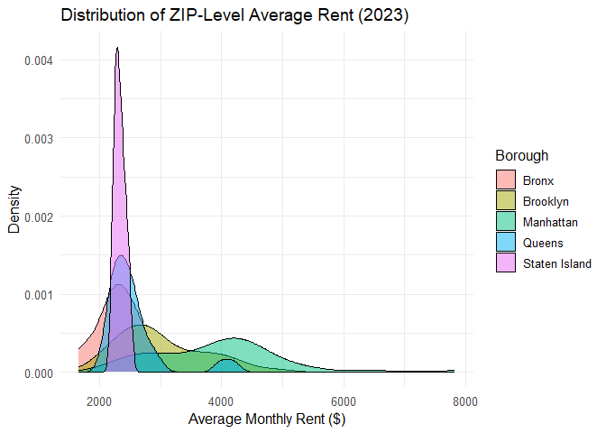

p8105_hw3_rl3616
================
Ruipeng Li
2025-10-10

# Problem 1

Loading data

``` r
library(p8105.datasets)
library(ggplot2)
library(tidyverse)
```

    ## ── Attaching core tidyverse packages ──────────────────────── tidyverse 2.0.0 ──
    ## ✔ dplyr     1.1.4     ✔ readr     2.1.5
    ## ✔ forcats   1.0.0     ✔ stringr   1.5.2
    ## ✔ lubridate 1.9.4     ✔ tibble    3.3.0
    ## ✔ purrr     1.1.0     ✔ tidyr     1.3.1
    ## ── Conflicts ────────────────────────────────────────── tidyverse_conflicts() ──
    ## ✖ dplyr::filter() masks stats::filter()
    ## ✖ dplyr::lag()    masks stats::lag()
    ## ℹ Use the conflicted package (<http://conflicted.r-lib.org/>) to force all conflicts to become errors

``` r
library(patchwork) #Combining plot
data("instacart") 
```

#### Part a)

The Instacart dataset contains 1,384,617 observations and 15 variables,
representing individual items from customers’ grocery orders.

Each observation corresponds to one product within an order, with
variables describing the order time `order_hour_of_day`, date in week
`order_dow`, customer `user_id`, product details
`product_name, aisle, department`, and purchase behavior
`add_to_cart_order, reordered, days_since_prior_order`.

The dataset allows exploration of shopping habits such as the most
popular aisles, frequently reordered products, and peak shopping hours.

#### Part b)

Also, there are 134 different aisles in the dataset, and

``` r
top_aisles <- instacart |> 
  count(aisle, sort = TRUE)
```

With this data, we can see the top 1 aisle that most items ordered from
was “fresh vegetables” and follow up with “fresh fruits” and “packaged
vegetables fruits”

#### Part c)

``` r
aisle_plot <- top_aisles |> 
  filter(n > 10000) |> 
  ggplot(aes(x = reorder(aisle, n), y = n)) +
  geom_col(width = 0.7, fill = "steelblue") +
  geom_text(aes(label = scales::comma(n)), 
            hjust = -0.1, size = 2.5) +
  coord_flip() +
  labs(
    title = "Aisles with more than 10,000 items ordered",
       x = "Aisle", y = "Number of items ordered"
    ) +
  scale_y_continuous(labels = scales::comma) +
  theme_minimal(base_size = 8)

ggsave("figures/Problem 1/aisle_plot.png", aisle_plot, width = 10, dpi = 300)
```

    ## Saving 10 x 5 in image

#### Part d)

``` r
top_item_table <- instacart |> 
  filter(aisle %in% c("baking ingredients", "dog food care", "packaged vegetables fruits")) |> 
  group_by(aisle, product_name) |>
  summarise(times_ordered = n()) |> 
  slice_max(times_ordered, n = 3)
```

    ## `summarise()` has grouped output by 'aisle'. You can override using the
    ## `.groups` argument.

#### Part e)

``` r
mean_hour_table <- instacart |> 
  filter(product_name %in% c("Pink Lady Apples", "Coffee Ice Cream")) |> 
  group_by(product_name, order_dow) |> 
  summarise(mean_hour = mean(order_hour_of_day)) |> 
  mutate(order_dow = factor(order_dow,
    levels = 0:6,
    labels = c("Sunday", "Monday", "Tuesday", "Wednesday", "Thursday", "Friday", "Saturday")
  )) |>
  pivot_wider(
    names_from = order_dow,
    values_from = mean_hour
  )
```

    ## `summarise()` has grouped output by 'product_name'. You can override using the
    ## `.groups` argument.

# Problem 2

#### Cleaning Zillow datasets(from homework 2)

``` r
zip_zori_df <- read_csv("data/Zip_zori_uc_sfrcondomfr_sm_month_NYC.csv") |> 
  janitor::clean_names() |>
  rename(zip_code = region_name) |> 
  select(-region_type, -state_name, -state, -city, -metro) |> 
  pivot_longer(
    cols = starts_with("x20"),
    names_to = "date",
    values_to = "rent_price"
  ) |> 
  filter(!is.na(rent_price)) |>
  mutate(
    county_name = str_replace(county_name, " County", ""),
    date = str_replace(date, "x", ""),
    date = ymd(date),
    year = lubridate::year(date),
    borough = case_when(
      county_name == "New York" ~ "Manhattan",
      county_name == "Kings" ~ "Brooklyn",
      county_name == "Queens" ~ "Queens",
      county_name == "Bronx" ~ "Bronx",
      county_name == "Richmond" ~ "Staten Island")
    ) |> 
   relocate("county_name","borough")
```

    ## Rows: 149 Columns: 125
    ## ── Column specification ────────────────────────────────────────────────────────
    ## Delimiter: ","
    ## chr   (6): RegionType, StateName, State, City, Metro, CountyName
    ## dbl (119): RegionID, SizeRank, RegionName, 2015-01-31, 2015-02-28, 2015-03-3...
    ## 
    ## ℹ Use `spec()` to retrieve the full column specification for this data.
    ## ℹ Specify the column types or set `show_col_types = FALSE` to quiet this message.

``` r
zip_count <- zip_zori_df |> 
  group_by(zip_code, county_name) |> 
  summarise(n_observed = n()) |> 
  arrange(desc(n_observed))
```

    ## `summarise()` has grouped output by 'zip_code'. You can override using the
    ## `.groups` argument.

Using this data, we can see there are 48 ZIP codes are observed 116
times, and there are 26 ZIP codes observed fewer than 10 times.

Using arranged data we can see almost all ZIPs in Manhattan and Brooklyn
appear 116 times; while many in Staten Island or the Bronx might appear
only a dozen or fewer times. I think it’s really depends on population
density. Which frequent appearances indicate rich data and active
listings; few appearances indicate an unpopular area, a change in
listings, or missing data.

#### Average rental price

``` r
mean_price <- zip_zori_df |> 
  group_by(year, borough) |> 
  summarise(average_price = mean(rent_price)) |> 
  pivot_wider(
    names_from = year,
    values_from = average_price
  )
```

    ## `summarise()` has grouped output by 'year'. You can override using the
    ## `.groups` argument.

As we can clearly see in the table, the average rent in almost every
borough has gradually increased over the past nine years.

Manhattan (New York County) is highest throughout and shows the largest
absolute increase (≈\$1k+ from 2015 to 2024).

Brooklyn (Kings) also climbs strongly, narrowing part of the gap with
Queens after 2021.

In contrast, Queens, Bronx and State Island saw modest growth.

#### NYC Rental Prices by ZIP Code

``` r
rental_prices_plot <- ggplot(zip_zori_df, aes(x = date, y = rent_price, group = zip_code, color = borough)) +
  geom_line(alpha = 0.3) +
  facet_wrap(~ borough) +
  labs(
    title = "NYC Rental Prices by ZIP Code (2015–2024)",
    x = "Year", y = "Monthly Rent ($)", color = "Borough"
  ) +
  theme_minimal(base_size = 8) |> 
  theme(legend.position = "none")
```

Overall, Brooklyn and Manhattan have more listings and higher prices,
and Manhattan even have some extremely higher-priced zip zones.

In addition, due to the COVID-19 pandemic in 2021, rents in these two
areas have generally decreased, with Manhattan being the most noticeable
(a huge dent). Meanwhile, rents in Queens haven’t been affected much,
and the Bronx has barely been affected.

``` r
# calculating rent_price 2023
rent_2023 <- zip_zori_df |> 
  filter(year == "2023") |> 
  group_by(borough, zip_code) |> 
  summarise(avg_rent_2023 = mean(rent_price, na.rm = TRUE))
```

    ## `summarise()` has grouped output by 'borough'. You can override using the
    ## `.groups` argument.

``` r
# Making plot
rent_2023_plot <- ggplot(rent_2023, aes(x = avg_rent_2023, fill = borough)) +
  geom_density(alpha = 0.5) +
  labs(
    title = "Distribution of ZIP-Level Average Rent (2023)",
    x = "Average Monthly Rent ($)", y = "Density", fill = "Borough"
  ) +
  theme_minimal(base_size = 12)
rent_2023_plot
```

<!-- -->
Using this density plot, we can easily see the price ranges in which
rental prices in each borough are concentrated. For example, almost all
rental prices in Staten Island are concentrated in the 2200-2600 range,
so they appear very high peak in the chart. In contrast, the charts for
Manhattan and Brooklyn are smooth, indicating that all types of rents
appear. At the same time, Manhattan rental price peaks at around 4300,
while Brooklyn rental prices peak at around 2700.

``` r
combined_plot <- (rental_prices_plot / rent_2023_plot) + plot_layout(heights = c(2,1))

ggsave("figures/Problem 2/combined_plot.png")
```

    ## Saving 7 x 5 in image

Combine the two previous plots into a single graphic, and export this to
a results folder in your repository.
